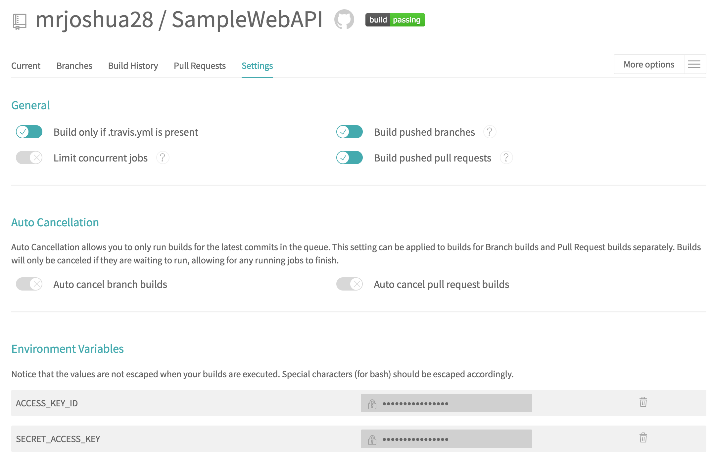
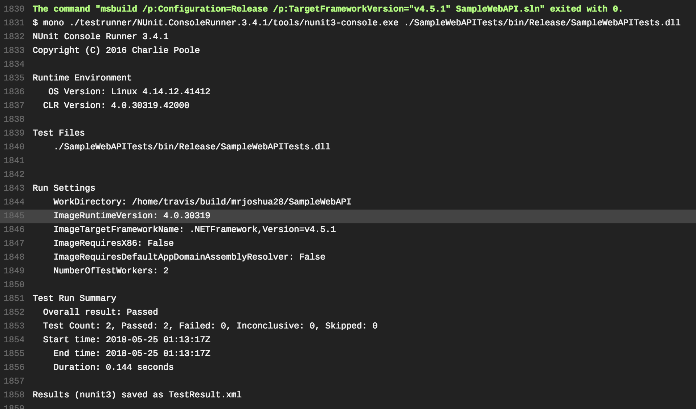
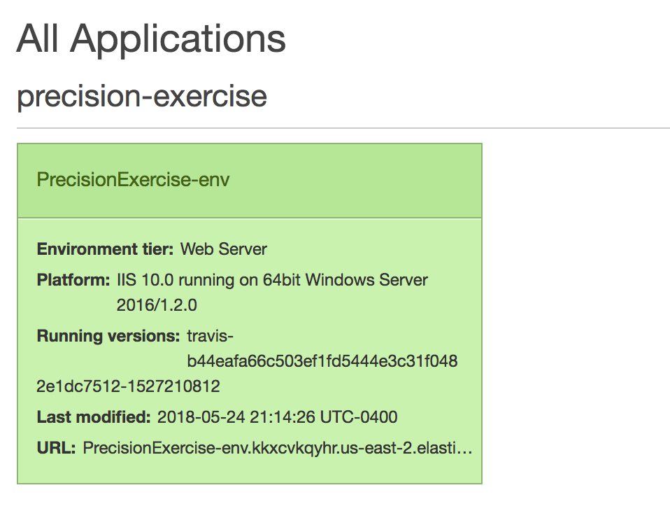

# SampleWebAPI

A small sample web api with tests, for playing around with CI tools. And MUCH MORE!

## How This Works

[Travis](https://www.travis-ci.com/) is watching... Travis integration has been installed. See [travis.yml](https://github.com/mrjoshua28/SampleWebAPI/blob/master/.travis.yml) for all the gory details.

Travis Settings:

Basially this is what's happening:

1. When a push is made to the repo: Travis builds the project and runs the tests.

2. When a Pull Request is created: Travis builds the project and runs the tests.

3. When a merge is made into Master: Travis builds the project and runs the tests. Travis will also package up the artifacts from the build and deploy to Elastic Beanstalk in AWS.

Sample Build Output:

I decided to use [AWS Elastic Beanstalk](https://aws.amazon.com/elasticbeanstalk/) to deploy the API, mainly because it's the only free-tier service I have left to use. The premise is that I can just give it the packaged up application and it will take it from there. LIES! Here's where I have attempted to deploy:

[Elastic Beanstalk URL](http://precisionexercise-env.kkxcvkqyhr.us-east-2.elasticbeanstalk.com/) - DOES NOT WORK

I seem to not be able to get the files packaged into a format that AWS likes. I am currently zipping up the Release build artifacts, but that doesn't seem to be working.

According to this [AWS Documentation](https://docs.aws.amazon.com/elasticbeanstalk/latest/dg/applications-sourcebundle.html#using-features.deployment.source.dotnet) I should be able to do something like `msbuild <web_app>.csproj /t:Package /p:DeployIisAppPath="Default Web Site"`. However, when I try that I am presented with an error that there is no build target named `Package`. I'm assuming I need to create one in Visual Studio, or give up and deploy to Azure

## Built With

* [Visual Studio](https://www.visualstudio.com/) - Good luck not using it!
* [.NET](https://www.microsoft.com/net/) - C# baby
* [NUnit](http://nunit.org/) - Test all the things!

## Contributing

Please read [CONTRIBUTING.md](https://github.com/mrjoshua28/SampleWebAPI/blob/master/CONTRIBUTING.md) for the process for submitting pull requests to us.

## License

This project is licensed under the MIT License - see the [LICENSE](LICENSE) file for details
